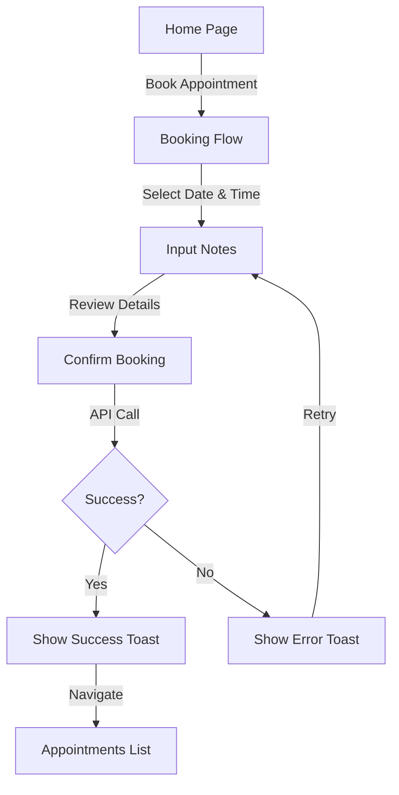

# ClinExa Mobile App 🏥

ClinExa is a premium, full-featured telemedicine and clinic management mobile application built with Flutter. It follows Clean Architecture principles to ensure scalability, maintainability, and a high-performance user experience.

## 🚀 Features

- **🔐 Dual-Role Authentication**: Secure login, registration, and password recovery.
- **📅 Appointment Booking**: Optimized single-doctor booking flow with date, time, and reason selection.
- **🔄 Rescheduling System**: Smart appointment management with 24-hour validation and real-time updates.
- **📄 Prescription Management**: View and track medical prescriptions from healthcare providers.
- **👤 Profile Management**: Customizable user profiles with real-time field validation and image upload via Cloudinary.
- **🌍 Advanced Localization**: Fully supported Arabic (AR) and English (EN) languages with automatic RTL layout switching.
- **✨ Premium UI/UX**:
  - **Shimmer Loading**: custom placeholders for a flicker-free loading experience.
  - **Consistent Toasts**: Professional feedback using `ToastHelper`.
  - **Centralized Navigation**: Semantic routing powered by `GoRouter`.

## 🏗️ Architecture & Project Structure

The project follows **Clean Architecture** patterns, divided into layers:

- **Domain Layer**: Core business logic (Entities, Repositories Interfaces, Use Cases).
- **Data Layer**: Implementation details (Models, Repositories Implementations, Remote/Local Data Sources).
- **Presentation Layer**: UI and State Management (Widgets, Pages, BLoC/Cubit).

### Folder Hierarchy

```text
lib/
├── app/                # Global theme, router, and common widgets
├── core/               # Utilities, networking, localization, and DI
├── features/           # Feature-based modularity
│   ├── auth/
│   ├── appointments/   # Booking and management
│   ├── prescriptions/
│   ├── profile/
│   └── home/
└── main.dart           # App entry point with Global Providers
```

## 🔄 Appointment Booking Flow



## 🛠️ Technical Stack

| Category             | Technology                        |
| -------------------- | --------------------------------- |
| **Framework**        | Flutter / Dart                    |
| **State Management** | BLoC / Cubit                      |
| **Routing**          | GoRouter                          |
| **Dep. Injection**   | GetIt                             |
| **Networking**       | Dio                               |
| **Storage**          | Shared Preferences                |
| **UI Enhancements**  | Shimmer, Iconsax, ScreenUtil      |
| **Localization**     | flutter_localization (JSON based) |

## 📦 Getting Started

1. **Clone the repository**
   ```bash
   git clone https://github.com/your-repo/clinexa-mobile.git
   ```
2. **Setup Dependencies**
   ```bash
   flutter pub get
   ```
3. **Run the App**
   ```bash
   # For debug mode
   flutter run
   ```

---

Developed with ❤️ by the ClinExa Team.
